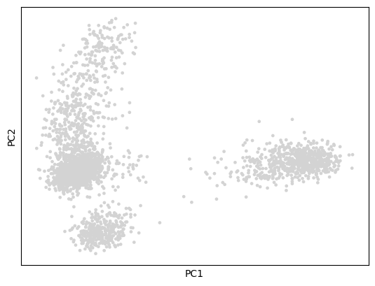
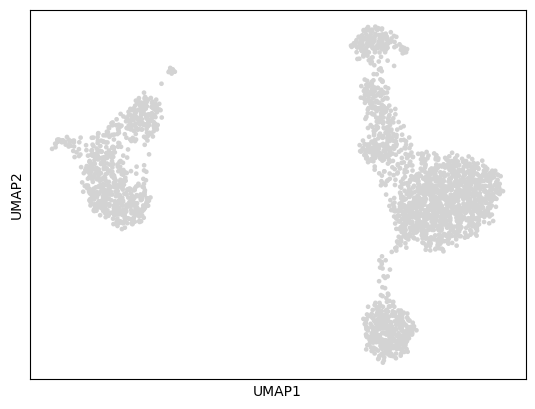
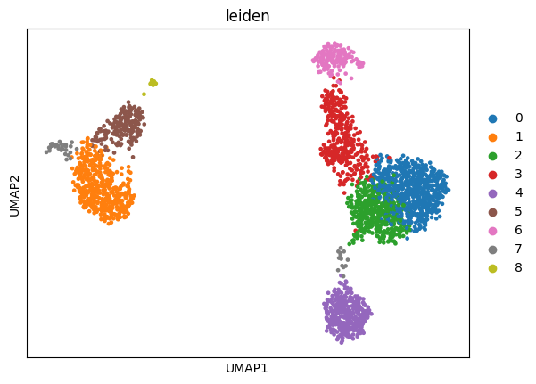

# Single-cell RNA-seq Analysis using Scanpy

# Project Overview

This project demonstrates an end-to-end single-cell RNA sequencing (scRNA-seq) analysis workflow using Python and Scanpy. The workflow includes data preprocessing, quality control, normalization, dimensionality reduction, clustering, and visualization of immune cell populations from a peripheral blood mononuclear cell (PBMC) dataset.
The project was developed using Ubuntu, VS Code, Jupyter Notebook, and Scanpy to understand the fundamentals of single-cell transcriptomics analysis and reproducible computational biology workflows.

# Biological Background

Single-cell RNA sequencing (scRNA-seq) enables transcriptomic profiling at single-cell resolution, allowing researchers to identify cellular heterogeneity, immune subpopulations, developmental trajectories, and disease-associated cell states.
Unlike bulk RNA-seq, scRNA-seq captures gene expression patterns from individual cells, making it possible to:

Identify distinct cell populations
Detect rare cell types
Study tumor microenvironment heterogeneity
Analyze immune responses
Investigate developmental processes

In this project, PBMC immune cells were analyzed using Scanpy.

# Objectives

The main objectives of this project were:

Learn the fundamentals of scRNA-seq analysis
Perform quality control and preprocessing
Normalize and scale gene expression data
Identify highly variable genes
Perform dimensionality reduction using PCA and UMAP
Cluster similar cells using Leiden clustering
Visualize immune cell populations
Save processed AnnData objects for downstream analysis

# Dataset

Dataset used:
PBMC 3K dataset from Scanpy
The dataset contains approximately 3,000 peripheral blood mononuclear cells (PBMCs).
Dataset source: https://scanpy.readthedocs.io/

# Tools and Technologies
 
Python - Programming language
Scanpy - Single-cell RNA-seq analysis
Jupyter Notebook -	Interactive analysis
VS Code -	Development environment
Ubuntu -	Operating system
Matplotlib -	Visualization
Pandas -	Data manipulation
NumPy -	Numerical operations
Leiden algorithm -	Cell clustering

# Workflow
## Step 1 — Import Required Packages
import scanpy as sc
import pandas as pd
import matplotlib.pyplot as plt

## Step 2 — Load Dataset
adata = sc.datasets.pbmc3k()
Load dataset into Scanpy AnnData object
Inspect dimensions:
number of cells
number of genes

## Step 3 — Quality Control
Quality control was performed to remove:

Low-quality cells
Dead cells
Lowly expressed genes
High mitochondrial content cells

adata.var['mt'] = adata.var_names.str.startswith('MT-')
sc.pp.calculate_qc_metrics(
    adata,
    qc_vars=['mt'],
    percent_top=None,
    log1p=False,
    inplace=True
)

## Step 4 — Filtering
sc.pp.filter_cells(adata, min_genes=200)
sc.pp.filter_genes(adata, min_cells=3)
adata = adata[adata.obs.pct_counts_mt < 5]

## Step 5 — Normalization
Normalize gene expression values across cells
Reduce technical variability
Apply log transformation
sc.pp.normalize_total(adata, target_sum=1e4)
sc.pp.log1p(adata)

## Step 6 — Highly Variable Gene Selection
Identify highly variable genes (HVGs)
Select informative genes for downstream analysis
sc.pp.highly_variable_genes(
    adata,
    min_mean=0.0125,
    max_mean=3,
    min_disp=0.5
)

## Step 7 — Principal Component Analysis (PCA)
Reduce high-dimensional data into principal components
Capture major biological variation

sc.tl.pca(adata)
 

## Step 8 — Neighbor Graph Construction
Compute similarity between cells
Build nearest-neighbor graph

sc.pp.neighbors(adata, n_neighbors=10, n_pcs=40)

## Step 9 — UMAP Visualization
sc.tl.umap(adata)
UMAP provides low-dimensional visualization of cell populations.

## Step 10 — Clustering
Group transcriptionally similar cells
Identify distinct cell populations using Leiden clustering

sc.tl.leiden(adata)
 
## Step 11 — Marker Gene Identification
Identify genes highly expressed in each cluster
Detect cluster-specific markers

sc.tl.rank_genes_groups(
    adata,
    'leiden',
    method='t-test'
)

## Step 12 — Save Processed Data
adata.write('../results/pbmc_analysis.h5ad')

# Results

<h1>Figures</h1>

<h2>Quality Control Plots</h2>

  

<h2>Highly Variable Genes</h2>

  

<h2>PCA Visualization</h2>

  

<h2>UMAP Visualization</h2>

  

<h2>Leiden Clustering</h2>

  

<h2>Marker Genes</h2>

  

# References

Scanpy Documentation
https://scanpy.readthedocs.io/

Single-cell Best Practices
https://www.sc-best-practices.org/

Human Cell Atlas
https://www.humancellatlas.org/

Author
Sudharshini Kannan
M.Sc. Agrobiotechnology (Bioinformatics and NGS Data Analysis)
 
